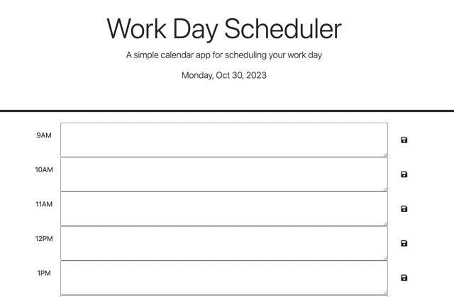

# **Work-Scheduler**

## **Description**
This project allowed me to use my knowledge of HTML, CSS and JavaScript to create a workday calendar that allows users to block off, track and save daily events between 9:00 AM and 5:00 PM. 

- - - -
## **Table of Contents**
- [Usage](#usage)
- [Website Preview](#website-preview)
- [Credits](#credits)
- [License](#license)
- [How to Contribute](#how-to-contribute)
- - - -
## **Usage**
To access and use my project, click the "Work Scheduler" link shown in the [Website Preview](#website-preview) section below. Keep track of the current day and time at the top of the website. Navigate the webpage by adding any paticular event to the appropriate time slot on the calendar. Users can then save and store the event in their local storage for later use.

The calendar is also color coded to indicate whether the event is in the past (grey), present (red), or future (green). 
- - - -
## **Website Preview**
[Work Scheduler](https://alexisstrong11.github.io/Work-Scheduler/)

- - - - 
## **Credits**
NOTE: *I received help from the instructors and tutors to assist with my project.*

- - - - 
## **License**
MIT License

Copyright (c) 2023 Alexis Strong

Permission is hereby granted, free of charge, to any person obtaining a copy
of this software and associated documentation files (the "Software"), to deal
in the Software without restriction, including without limitation the rights
to use, copy, modify, merge, publish, distribute, sublicense, and/or sell
copies of the Software, and to permit persons to whom the Software is
furnished to do so, subject to the following conditions:

The above copyright notice and this permission notice shall be included in all
copies or substantial portions of the Software.

THE SOFTWARE IS PROVIDED "AS IS", WITHOUT WARRANTY OF ANY KIND, EXPRESS OR
IMPLIED, INCLUDING BUT NOT LIMITED TO THE WARRANTIES OF MERCHANTABILITY,
FITNESS FOR A PARTICULAR PURPOSE AND NONINFRINGEMENT. IN NO EVENT SHALL THE
AUTHORS OR COPYRIGHT HOLDERS BE LIABLE FOR ANY CLAIM, DAMAGES OR OTHER
LIABILITY, WHETHER IN AN ACTION OF CONTRACT, TORT OR OTHERWISE, ARISING FROM,
OUT OF OR IN CONNECTION WITH THE SOFTWARE OR THE USE OR OTHER DEALINGS IN THE
SOFTWARE.
- - - - 
## **How to Contribute**
[Contributor Covenant](https://www.contributor-covenant.org/)